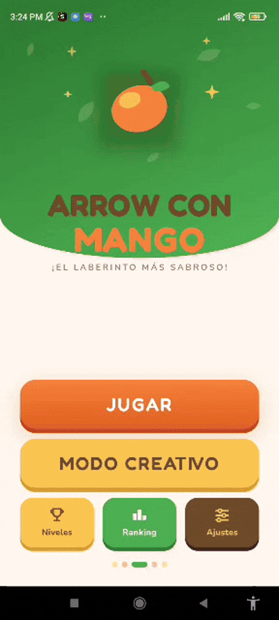
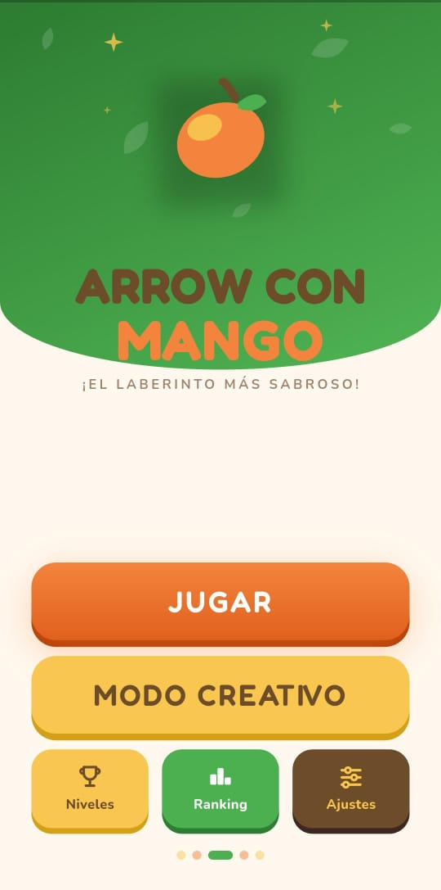
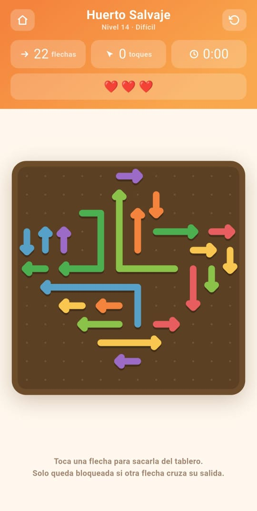
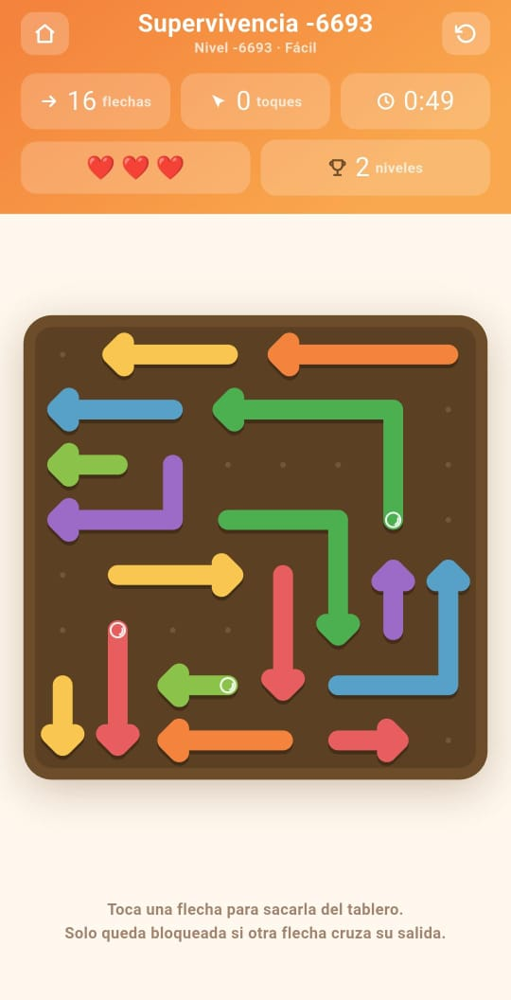
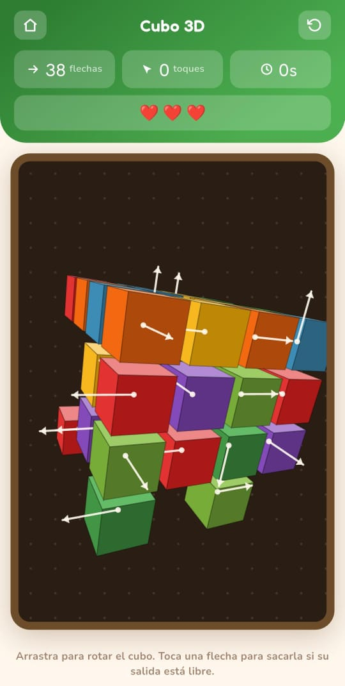
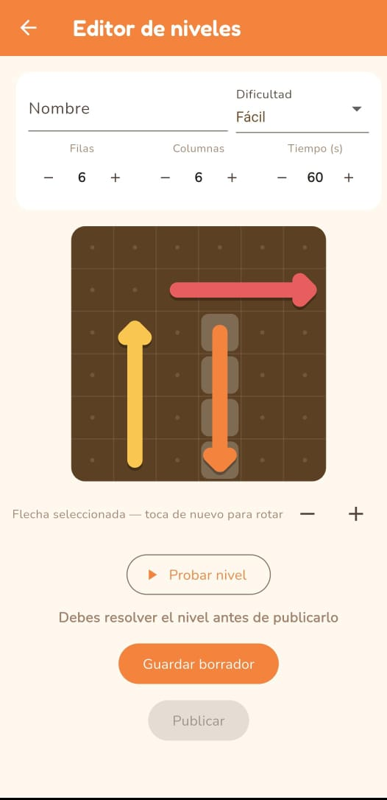
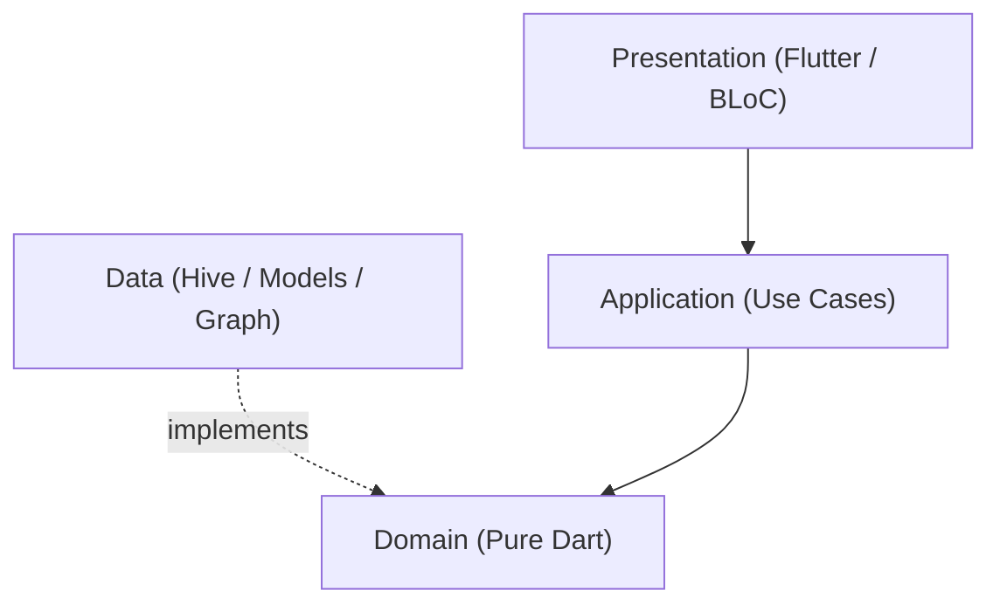

# ArrowConMango (Frontend)
[](https://github.com/tu-usuario/arrowconmango_front/actions)
[]()
[](https://opensource.org/licenses/MIT)

## Description
**ArrowConMango** es un juego de puzzles estilo *Arrow Maze* desarrollado en Flutter. El objetivo del juego es deslizar flechas fuera de un tablero teniendo cuidado de que no colisionen entre sí. Este repositorio contiene el cliente móvil desarrollado bajo estrictos principios académicos de la materia Desarrollo de Software (Clean Architecture, SOLID y Design Patterns).

Cuenta con los siguientes modos de juego:
*   **Campaña (2D):** Niveles prediseñados con penalizaciones de tiempo y errores.
*   **Supervivencia:** Modo de resistencia infinito (endless) para poner a prueba tu velocidad mental.
*   **Cubo 3D:** Retos espaciales generados en un entorno tridimensional con físicas de rotación de 360 grados.
*   **Modo Creativo:** Crea tus propios mapas de Arrow con Mango y compartelos con la comunidad.
---

## Demo / Screenshots

<div align="center">
  
  <br>
  <i>🕹️ Demo del juego en acción</i>
</div>

<br>

### 📸 Galerías y Modos de Juego

<table align="center">
  <tr>
    <td align="center"><b>Menú Principal</b><br><br></td>
    <td align="center"><b>Modo Campaña</b><br><br></td>
    <td align="center"><b>Supervivencia</b><br><br></td>
  </tr>
  <tr>
    <td align="center"><b>Modo Cubo 3D</b><br><br></td>
    <td align="center"><b>Modo Creativo</b><br><br></td>
    <td align="center"><!-- Espacio Vacío --></td>
  </tr>
</table>

---

## Architecture
Este proyecto implementa **Clean Architecture** estructurado rígidamente en 4 capas para mantener una **alta cohesión interna y un bajo acoplamiento externo**:

1.  **Domain:** Entidades puras en Dart (`GameSession`, `BoardState`), interfaces de topología espacial (`Topology`) y errores (`Failure`). 0% dependencias de Flutter.
2.  **Application:** Casos de uso atómicos (`LoadLevelUseCase`, `EvaluateGameStateUseCase`) orquestando el dominio.
3.  **Data:** Repositorios concretos (`HiveLevelRepository`), modelos (`LevelModel`) y adaptadores (Mappers y Hive TypeAdapters).
4.  **Presentation:** Gestión de estado reactiva con BLoC (`GameBloc`), widgets y UI de Flutter.



### Class Diagram Completo

```mermaid
classDiagram
    direction LR

    namespace Presentation_Interface_Adapters {
        class GameBloc:::adapter {
            <<State Pattern / Observer>>
            +onTriggerArrowExit(event, emit)
            +onUndoMove(event, emit)
            +onStartGame(event, emit)
        }
        class GameState:::adapter {
            <<State Pattern>>
        }
        class GamePlaying:::adapter {
            +levelId int
            +levelName String
            +difficulty String
            +rows int
            +cols int
            +moveCount int
            +arrowsRemaining int
            +elapsedSeconds int
            +mistakes int
            +livesRemaining int
            +isEndlessMode bool
        }
        class GameStateMapper:::adapter {
            <<Adapter / Mapper>>
            +toDomain(state) GameSession
            +toPresentation(session) GameState
        }
        class AppBlocObserver:::adapter {
            <<Interceptor / AOP>>
            +onChange()
            +onError()
        }
    }

    namespace Application_Use_Cases {
        class CalculateScoreUseCase:::usecase {
            <<Application Service>>
            +call(moves, elapsedSeconds, mistakes) Result~Score~
        }
        class EvaluateGameStateUseCase:::usecase {
            <<Application Service>>
            +call(session, nowMs) GameEvaluation
        }
        class GetLevelDefinitionUseCase:::usecase {
            <<Application Service>>
            +call(levelId) Result~Level~
        }
        class GetLevelListUseCase:::usecase {
            <<Application Service>>
            +call() Result~List_int~
        }
        class LoadLevelUseCase:::usecase {
            <<Application Service>>
            +call(levelId) Result~Level~
        }
        class LoadProgressUseCase:::usecase {
            <<Application Service>>
            +call() Result~AppProgress~
        }
        class SaveLocalProgressUseCase:::usecase {
            <<Application Service>>
            +call(progress) Result~void~
        }
        class StartGameSessionUseCase:::usecase {
            <<Application Service>>
            +call(level) Result~GameSession~
        }
        class TriggerArrowExitUseCase:::usecase {
            <<Application Service>>
            +call(session, arrowId) Result~GameSession~
        }
        class UndoMoveUseCase:::usecase {
            <<Application Service>>
            +call(session) Result~GameSession~
        }
        class UnlockNextLevelUseCase:::usecase {
            <<Application Service>>
            +call(currentLevel, score) Result~AppProgress~
        }
    }

    namespace Domain_Entities {
        class Level:::domain {
            <<Aggregate Root>>
            +levelId int
            +name String
            +rows int
            +cols int
            +difficulty() String
            +startSession(sessionId, startedAtMs) GameSession
        }
        class AppProgress:::domain {
            <<Aggregate Root>>
            -unlockedLevels List~int~
            -stars Map
        }
        class GameSession:::domain {
            <<Aggregate Root>>
            -sessionId String
            -mistakes int
            +afterMistake() GameSession
        }
        class BoardState:::domain {
            <<Entity>>
            -_arrows Map
            -_nodeIndex Map
            +getArrowAtNode(node) ArrowEntity
            +withoutArrow(arrow) BoardState
            +replacing(updated) BoardState
        }
        class ArrowEntity:::domain {
            <<Entity>>
            +id String
            +length int
            +isSwitchable bool
            +withShiftedNodes(newNodes) ArrowEntity
            +withDirection(newDirection) ArrowEntity
        }
        class CommandHistory:::domain {
            <<Entity>>
            +canUndo bool
            +length int
            +push(command) CommandHistory
            +pop() MoveCommand
        }
        class Score:::domain {
            <<Value Object>>
            +moves int
            +timeElapsed int
            +totalPoints int
            +calculateFinal() int
            +copyWith() Score
        }
        class MoveCommand:::domain {
            <<Command / Value Object>>
            +previousState BoardState
        }
        class BoardGeometry:::domain {
            <<Value Object>>
            +rows int
            +cols int
            +depth int
        }
        class NodeId:::domain {
            <<Value Object>>
            +key String
        }
        class ExitCheckResult:::domain {
            <<Value Object>>
            +canExit bool
        }
        class DirectionEnum:::domain {
            <<Enum>>
            +value String
            +getOpposite() DirectionEnum
        }
        class CardinalDirection:::domain {
            <<Enum>>
            +UP
            +DOWN
            +LEFT
            +RIGHT
            +getOpposite() DirectionEnum
        }
        class SpatialDirection:::domain {
            <<Enum>>
            +FRONT
            +BACK
            +UP
            +DOWN
            +LEFT
            +RIGHT
            +getOpposite() DirectionEnum
        }
        class Result:::domain {
            <<Monad / Value Object>>
            +isSuccess bool
        }
        class Failure:::domain {
            <<Value Object>>
            -message String
        }
        class PathBlockedFailure:::domain {
            <<Domain Event / Exception>>
            -blockingArrowId String
        }
        class ScoringStrategy:::domain {
            <<Domain Service / Strategy>>
            +calculateScore(moves, seconds, mistakes) Score
        }
        class MoveBasedScoring:::domain {
            +calculateScore(moves, seconds, mistakes) Score
        }
        class CubeMangoScoring:::domain {
            +calculateScore(moves, seconds, mistakes) Score
        }
        class LevelBuilder:::domain {
            <<Builder Pattern>>
            +build() Level
        }
        class ILevelRepository:::domain {
            <<Repository>>
            +loadLevel(levelId) Result~Level~
        }
        class IProgressRepository:::domain {
            <<Repository>>
            +loadProgress() Result~AppProgress~
            +saveProgress(progress) Result~void~
        }
    }

    namespace Data_Frameworks_Infrastructure {
        class HiveLevelRepository:::infra {
            <<Adapter>>
            +loadLevel(levelId) Result~Level~
        }
        class HiveProgressRepository:::infra {
            <<Adapter>>
            +loadProgress() Result~AppProgress~
            +saveProgress(progress) Result~void~
        }
        class SyncedProgressRepository:::infra {
            <<Adapter>>
            +loadProgress() Result~AppProgress~
            +saveProgress(progress) Result~void~
        }
        class LevelModel:::infra {
            <<DTO>>
            -id int
            -name String
            -difficulty String
            -boardSize BoardSizeModel
            -boardState BoardStateModel
            +fromJson(json)
            +toJson()
        }
        class AppProgressModel:::infra {
            <<DTO>>
            -currentLevel int
            -completedLevels List~int~
            -scores Map
            +fromJson(json)
            +toJson()
        }
        class LevelModelAdapter:::infra {
            <<TypeAdapter>>
            +read(reader)
            +write(writer, obj)
        }
    }

    %% Presentation Relationships
    GamePlaying --|> GameState
    GameBloc "1" --> "1" GameState : emits
    GameBloc "1" --> "1" GameStateMapper : uses
    AppBlocObserver "1" --> "0..*" GameBloc : observes
    GameBloc ..> TriggerArrowExitUseCase : depends on
    GameBloc ..> UndoMoveUseCase : depends on

    %% Application Relationships
    CalculateScoreUseCase ..> Score : returns
    TriggerArrowExitUseCase ..> Result : returns
    LoadLevelUseCase ..> ILevelRepository : depends on
    LoadProgressUseCase ..> IProgressRepository : depends on
    CalculateScoreUseCase ..> ScoringStrategy : depends on
    LoadProgressUseCase ..> AppProgress : returns
    UnlockNextLevelUseCase ..> AppProgress : returns
    SaveLocalProgressUseCase ..> AppProgress : uses

    %% Domain Relationships
    Level "1" o-- "1" BoardState : contains
    Level "1" *-- "1" BoardGeometry : has
    GameSession "1" *-- "1" BoardState : owns
    BoardState "1" *-- "0..*" ArrowEntity : composed of
    ArrowEntity "1" *-- "1" NodeId : uses
    ArrowEntity "1" *-- "1" DirectionEnum : uses
    CardinalDirection ..|> DirectionEnum
    SpatialDirection ..|> DirectionEnum
    GameSession "1" *-- "1" CommandHistory : owns
    CommandHistory "1" o-- "0..*" MoveCommand : aggregates
    LevelBuilder ..> Level : builds
    Result "1" *-- "0..1" Failure : contains
    PathBlockedFailure --|> Failure
    MoveBasedScoring ..|> ScoringStrategy
    CubeMangoScoring ..|> ScoringStrategy
    IProgressRepository ..> AppProgress : manages

    %% Data Relationships
    HiveLevelRepository ..|> ILevelRepository
    HiveProgressRepository ..|> IProgressRepository
    SyncedProgressRepository ..|> IProgressRepository
    HiveLevelRepository ..> LevelModel : maps
    HiveProgressRepository ..> AppProgressModel : maps
    LevelModelAdapter ..> LevelModel : serializes

    %% Estilos de Capas (Colores)
    classDef domain fill:#FFF2CC,stroke:#D6B656,stroke-width:2px,color:#000
    classDef usecase fill:#E1D5E7,stroke:#9673A6,stroke-width:2px,color:#000
    classDef adapter fill:#DAE8FC,stroke:#6C8EBF,stroke-width:2px,color:#000
    classDef infra fill:#F8CECC,stroke:#B85450,stroke-width:2px,color:#000
```

<details>
<summary><b>Ver Diagrama de Clases Detallado</b></summary>


</details>

### Project Structure (Directorios)
La estructura de carpetas refleja visualmente la separación de capas por cada *feature*, facilitando la navegación y el mantenimiento del código:

```text
lib/
├── core/               # Código transversal: Tema, AOP, Inyección de Dependencias, Router
├── features/
│   ├── game/           # Core del juego (Arrow Maze)
│   │   ├── data/       # Modelos DTO, TypeAdapters y Repositorios (Hive)
│   │   ├── domain/     # Entidades puras, Interfaces de repositorios y Errores
│   │   ├── application/# Casos de Uso (Use Cases) que orquestan el negocio
│   │   └── presentation/# Widgets, Pantallas y Gestores de estado (BLoC)
│   ├── leaderboard/    # Funcionalidad de tabla de clasificaciones
│   └── player/         # Funcionalidad de gestión de jugador
└── main.dart           # Punto de entrada principal
```

---

## Design Patterns

| Patrón | Descripción Breve | Enlace de Ejemplo |
|---|---|---|
| **Strategy** | Algoritmos de puntuación intercambiables para 2D vs 3D. | [ScoringStrategy](lib/features/game/domain/entities/scoring_strategy.dart) |
| **Command** | Encapsulamiento de movimientos y estado histórico para permitir "Deshacer" (Undo). | [MoveCommand](lib/features/game/domain/entities/move_command.dart) |
| **Builder** | Construcción fluida y compleja de niveles y tableros. | [LevelBuilder](lib/features/game/domain/services/level_builder.dart) |
| **State** | Gestión del ciclo de vida del juego (Playing, Loading, GameOver). | [GameState](lib/features/game/presentation/bloc/game_state.dart) |
| **Adapter** | Adaptador que permite al dominio interactuar con la DB local (Hive). | [HiveLevelRepository](lib/features/game/data/repositories/hive_level_repository.dart) |
| **Observer** | Reactividad del UI ante cambios en el juego vía `flutter_bloc`. | [GameBloc](lib/features/game/presentation/bloc/game_bloc.dart) |
| **Mapper** | Traducción bidireccional entre Data Models y Domain Entities. | [GameStateMapper](lib/features/game/presentation/bloc/mappers/game_state_mapper.dart) |

---

## SOLID Principles

- **SRP (Single Responsibility Principle):** Cada clase tiene un único propósito. Por ejemplo, `CalculateScoreUseCase` se encarga exclusivamente de calcular el puntaje, delegando las reglas exactas a la estrategia inyectada.
  ```dart
  class CalculateScoreUseCase {
    final ScoringStrategy _scoringStrategy;
    Result<Score> call({required int moves, required int elapsedSeconds, int mistakes = 0}) {
      // Única responsabilidad: Orquestar el cálculo
    }
  }
  ```

- **OCP (Open/Closed Principle):** El sistema de puntuación permite añadir nuevas mecánicas creando nuevas clases sin modificar el evaluador principal.
  ```dart
  abstract class ScoringStrategy {
    Score calculateScore(int moves, int seconds, {int mistakes = 0});
  }
  // Abierto a extensión:
  class MoveBasedScoring implements ScoringStrategy { ... }
  class CubeMangoScoring implements ScoringStrategy { ... }
  ```

- **LSP (Liskov Substitution Principle):** Se utiliza una jerarquía polimórfica para el manejo de errores. Cualquier fallo devuelto por los casos de uso deriva de `Failure`, lo que permite sustituirlo de forma segura en las respuestas.
  ```dart
  abstract class Failure extends Equatable implements Exception { ... }
  
  // Sustituciones seguras:
  class PathBlockedFailure extends Failure { ... }
  class ArrowNotFoundFailure extends Failure { ... }
  ```

- **ISP (Interface Segregation Principle):** Las dependencias de datos están divididas en contratos pequeños y específicos (`ILevelRepository`, `IProgressRepository`) en lugar de tener un "Dios Repositorio" gigantesco.
  ```dart
  abstract class ILevelRepository {
    Future<Result<Level>> loadLevel(int levelId);
    // Solo métodos de niveles
  }
  ```

- **DIP (Dependency Inversion Principle):** Los casos de uso de la capa de aplicación dependen de abstracciones (interfaces del dominio), no de las implementaciones concretas de bases de datos.
  ```dart
  class LoadLevelUseCase {
    // Depende del contrato abstracto, no de HiveLevelRepository
    final ILevelRepository _repository; 
    const LoadLevelUseCase(this._repository);
  }
  ```

---

## AOP (Aspect-Oriented Programming)

El proyecto utiliza **Programación Orientada a Aspectos** para manejar preocupaciones transversales (Cross-Cutting Concerns) de forma desacoplada:

- **Global State Logging & Analytics:** Se implementó un observador global [AppBlocObserver](lib/core/aop/app_bloc_observer.dart) que actúa como un interceptor en la capa de Presentación. Registra automáticamente cada transición de estado (`onChange`, `onError`, `onTransition`) de todos los BLoCs de la aplicación.
  Esto evita contaminar la lógica de negocio o los controladores UI con sentencias manuales de `print` o envío de telemetría, adhiriéndose al principio **SRP**.

---

## Getting Started

### Requisitos previos
- [Flutter SDK](https://docs.flutter.dev/get-started/install) >= 3.19.0
- Dart >= 3.3.0

### Instrucciones paso a paso
1. **Clonar el repositorio:**
   ```bash
   git clone https://github.com/a-granadillo/ArrowConMango_Front.git
   ```
2. **Entrar al directorio:**
   ```bash
   cd arrowconmango_front
   ```
3. **Instalar dependencias:**
   ```bash
   flutter pub get
   ```
4. **Ejecutar en la web (Chrome):**
   Para probar rápidamente el juego desde el navegador:
   ```bash
   flutter run -d chrome
   ```
5. **Construir el ejecutable APK (Android):**
   Para generar el archivo instalable de Android en la ruta `build/app/outputs/flutter-apk/app-release.apk`:
   ```bash
   flutter build apk
   ```

---

## Running Tests
El proyecto cuenta con una robusta suite de pruebas unitarias que validan el dominio, los casos de uso, los repositorios locales y el BLoC, usando el patrón estricto **AAA (Arrange, Act, Assert)**.

Para correr toda la suite de pruebas desde la consola:
```bash
flutter test
```

---

## AI Usage Documentation
Este proyecto sigue rigurosamente el protocolo de rastreo de uso de Inteligencia Artificial para el diseño arquitectónico y desarrollo de código.

Puedes consultar el log completo y detallado de interacciones, decisiones de arquitectura y prompts utilizados en el archivo dedicado:
👉 [AI_USAGE.MD](./AI_USAGE.MD)

---

## Contributing
El desarrollo de este proyecto se gestionó ágilmente utilizando **GitHub Issues** para la división del trabajo:

1. **Issues:** Cada nueva característica o refactorización arquitectónica se registró como un issue individual asignado a un miembro del equipo.
2. **Ramas (Branches):** Se crearon ramas dedicadas vinculadas directamente a cada issue (ej. `feature/12-arrow-rotation`) partiendo siempre de `develop`.
3. **Conventional Commits:** Todos los commits siguen la estructura `<tipo>(<alcance opcional>): <descripción>` (Ej. `feat(domain): add mistake tracking`).
4. **Pull Requests:** Al finalizar una tarea, el PR asociado debe ser revisado y pasar el pipeline de CI/CD (Linter, Tests) antes de fusionarse a la rama principal.

---

## Team & Credits

### Development Team (Desarrollo de Software)
*   **Abraham Granadillo**
*   **Alberto Monasterio**
*   **José Rafael Matías Silveira**

### Original Soundtrack & Audio
*   Música compuesta y producida por **Sebastián Iribarren** 
*   Instagram: [@sebas.iribarren](https://www.instagram.com/sebas.iribarren)

---

## License
Este proyecto se distribuye bajo la licencia **MIT License**. Consulta el archivo `LICENSE` para más información. 

