# Especificación de Arquitectura Frontend (Cliente) - Arrow Maze

Este documento define la estructura, patrones y estrategias arquitectónicas para la aplicación móvil de **Arrow Maze**, construida en **Flutter**. El diseño cumple con los requisitos del proyecto garantizando una separación estricta de responsabilidades mediante Clean Architecture, la implementación de patrones GoF, Programación Orientada a Aspectos (AOP), el cumplimiento de los principios SOLID y un manejo de estado reactivo mediante el patrón BLoC.

---

## 1. Arquitectura de Capas (Clean Architecture)

La aplicación se estructura siguiendo el principio de "Feature-First" (agrupación por funcionalidades) y, dentro de cada módulo, se aplican las 4 capas concéntricas de Clean Architecture.

Para garantizar la **Regla de Dependencia** hacia adentro, la Capa de Dominio está escrita en **Dart puro** (cero dependencias de Flutter o librerías externas), lo que permite ejecutar pruebas unitarias a máxima velocidad.

```text
lib/
├── core/                           # Código transversal (Compartido)
│   ├── aop/                        # Interceptores y Decoradores (ej. LoggingDecorator)
│   ├── di/                         # Inyección de Dependencias (Service Locator)
│   └── errors/                     # Excepciones de dominio y Failures
│
└── features/
    └── game/                       # Módulo principal del juego
        │
        ├── domain/                 # CAPAS 1 y 2: Reglas de negocio puras (Dart puro)
        │   ├── entities/           # Capa 1: Entidades y Grafo (Board, Cell, ArrowCell)
        │   ├── repositories/       # Puertos/Interfaces (ILevelRepository, IRemoteApiRepository)
        │   └── use_cases/          # Capa 2: Casos de Uso (RotateArrowUseCase, EvaluateGameStateUseCase)
        │
        ├── data/                   # CAPA 3 y 4: Gestión de datos e infraestructura
        │   ├── models/             # DTOs y Mappers (Serialización JSON/Hive)
        │   ├── repositories/       # Capa 3: Implementaciones (HiveLocalStorageAdapter, DioApiAdapter)
        │   └── datasources/        # Capa 4: Consumo directo de API REST o Base de datos local
        │
        └── presentation/           # CAPAS 3 y 4: UI y Manejo de Estado
            ├── bloc/               # Capa 3: Adaptadores de Interfaz (BoardBloc, Events, States)
            ├── screens/            # Capa 4: Vistas Flutter (FlutterGameScreen, FlutterMenuScreen)
            └── widgets/            # Capa 4: Componentes visuales (BoardGridWidget)
```

### Descripción de Capas

| Capa | Nombre | Responsabilidad | Dependencias |
|------|--------|----------------|--------------|
| **1** | Entidades (Domain) | Objetos de negocio fundamentales. Clases puras en Dart que modelan el tablero como un Grafo Dirigido en memoria. | Ninguna (Dart puro) |
| **2** | Casos de Uso (Application) | Lógica de aplicación. Orquestan el flujo de datos entre entidades y repositorios. Dependen únicamente de interfaces. | Solo interfaces de Capa 1 |
| **3** | Adaptadores de Interfaz | Convierten datos entre el dominio y frameworks externos. Incluye BLoC, implementaciones de repositorios y mappers. | Capas 1 y 2 |
| **4** | Frameworks e Infraestructura | Detalles volátiles: Flutter widgets, librerías de red (Dio), almacenamiento local (Hive). | Capas 1, 2 y 3 |

---

## 2. Diagrama de Clases y Capas

El siguiente diagrama detalla la arquitectura del cliente, modelando el tablero como un Grafo Dirigido en memoria y delegando la reactividad al patrón BLoC en la capa de presentación.

```mermaid
classDiagram
    direction BT

    namespace 1_Domain_Entities {
      class CellComponent {
        <<interface>>
        +executeAction() void
      }
      class Cell {
        <<abstract>>
        -String id
        -Position position
        -bool isActivated
        -List~Cell~ neighbors
        +getConnectedCell(Direction dir) Cell
        +rotate()* void
        +executeAction() void
      }
      class ArrowCell {
        -Direction direction
        +rotate() void
      }
      class WallCell {
        +rotate() void
      }
      class EmptyCell {
        +rotate() void
      }
      class ExitCell {
        +rotate() void
      }
      class Board {
        -List~CellComponent~ cells
        +add(CellComponent c) void
        +executeAction() void
      }
      class Score {
        -int moves
        -int timeElapsed
        -int totalPoints
        +calculateFinal() int
      }
      class ScoringStrategy {
        <<interface>>
        +calculateScore(int moves, int seconds)* Score
      }
      class TimeBasedScoring {
        +calculateScore(int moves, int seconds) Score
      }
      class MovesBasedScoring {
        +calculateScore(int moves, int seconds) Score
      }
      class MoveCommand {
        -Cell cell
        +execute() void
        +undo() void
      }
      class CommandHistory {
        -List~MoveCommand~ history
        +push(MoveCommand cmd) void
        +pop() MoveCommand
      }
      class Level {
        -int levelId
        -Board templateBoard
        +difficulty() String
      }
      class GameSession {
        -String sessionId
        -Board activeBoard
        -CommandHistory history
        +applyMove(MoveCommand cmd) void
        +undoLastMove() void
      }
      class AppProgress {
        -List~int~ unlockedLevels
        -String currentToken
        +unlockLevel(int levelId) void
      }
      class ILevelRepository {
        <<interface>>
        +getLevelFromLocal(int id)* Level
      }
      class IProgressRepository {
        <<interface>>
        +getLocalProgress()* AppProgress
        +saveProgressLocally(AppProgress p)* void
      }
      class IRemoteApiRepository {
        <<interface>>
        +syncProgressWithBackend(AppProgress p)* void
        +fetchGlobalLeaderboard(int levelId)* List~Score~
      }
    }

    namespace 2_Application_UseCases {
      class IUseCase {
        <<interface>>
        +execute()* void
      }
      class LoggingUseCaseDecorator {
        -IUseCase decoratedUseCase
        +execute() void
      }
      class LoadLevelUseCase {
        -ILevelRepository levelRepo
        +execute(int levelId) GameSession
      }
      class RotateArrowUseCase {
        -GameSession session
        +execute(String cellId) void
      }
      class UndoMoveUseCase {
        -GameSession session
        +execute() void
      }
      class EvaluateGameStateUseCase {
        -GameSession session
        -ScoringStrategy strategy
        +execute() Score
      }
      class SaveLocalProgressUseCase {
        -IProgressRepository progressRepo
        +execute(int levelId) void
      }
      class SyncWithBackendUseCase {
        -IRemoteApiRepository remoteRepo
        -IProgressRepository progressRepo
        +execute() void
      }
      class FetchLeaderboardUseCase {
        -IRemoteApiRepository remoteRepo
        +execute(int levelId) List~Score~
      }
    }

    namespace 3_Presentation_BLoC {
      class GameEvent {
        <<abstract>>
      }
      class CellTappedEvent {
        +String cellId
      }
      class UndoPressedEvent
      class GameState {
        <<abstract>>
        -GameSession currentSession
      }
      class PlayingState
      class VictoryState
      class BoardBloc {
        -LoadLevelUseCase loadLevelUseCase
        -RotateArrowUseCase rotateArrowUseCase
        -UndoMoveUseCase undoMoveUseCase
        -EvaluateGameStateUseCase evaluateGameStateUseCase
        -SaveLocalProgressUseCase saveLocalProgressUseCase
        +onCellTapped(CellTappedEvent event)
        +onUndoPressed(UndoPressedEvent event)
      }
      class MenuBloc {
        -SyncWithBackendUseCase syncWithBackendUseCase
        -FetchLeaderboardUseCase fetchLeaderboardUseCase
        +onSyncRequested()
        +onLoadLeaderboard()
      }
    }

    namespace 4_Frameworks_Drivers {
      class DioApiAdapter {
        +post(String url, dynamic data) dynamic
      }
      class HiveLocalStorageAdapter {
        +read(String key) dynamic
      }
      class FlutterGameScreen {
        +build(BuildContext context) Widget
      }
      class FlutterMenuScreen {
        +build(BuildContext context) Widget
      }
    }

    %% Relaciones
    CellComponent <|-- Cell
    CellComponent <|-- Board
    Cell <|-- ArrowCell
    Cell <|-- WallCell
    Cell <|-- EmptyCell
    Cell <|-- ExitCell

    ScoringStrategy <|-- TimeBasedScoring
    ScoringStrategy <|-- MovesBasedScoring

    GameEvent <|-- CellTappedEvent
    GameEvent <|-- UndoPressedEvent
    GameState <|-- PlayingState
    GameState <|-- VictoryState

    IUseCase <|-- LoadLevelUseCase
    IUseCase <|-- RotateArrowUseCase
    IUseCase <|-- UndoMoveUseCase
    IUseCase <|-- EvaluateGameStateUseCase
    IUseCase <|-- SaveLocalProgressUseCase
    IUseCase <|-- SyncWithBackendUseCase
    IUseCase <|-- FetchLeaderboardUseCase
    IUseCase <|-- LoggingUseCaseDecorator

    IRemoteApiRepository <|.. DioApiAdapter
    ILevelRepository <|.. HiveLocalStorageAdapter
    IProgressRepository <|.. HiveLocalStorageAdapter

    Board "1" *-- "*" CellComponent
    GameSession "1" *-- "1" Board
    GameSession "1" *-- "1" CommandHistory
    CommandHistory "1" *-- "*" MoveCommand
    MoveCommand "1" --> "1" Cell

    EvaluateGameStateUseCase --> ScoringStrategy

    BoardBloc --> LoadLevelUseCase
    BoardBloc --> RotateArrowUseCase
    BoardBloc --> UndoMoveUseCase
    BoardBloc --> EvaluateGameStateUseCase
    BoardBloc --> SaveLocalProgressUseCase

    MenuBloc --> SyncWithBackendUseCase
    MenuBloc --> FetchLeaderboardUseCase

    BoardBloc --> GameEvent
    BoardBloc --> GameState

    LoadLevelUseCase --> ILevelRepository
    SaveLocalProgressUseCase --> IProgressRepository
    SyncWithBackendUseCase --> IProgressRepository
    SyncWithBackendUseCase --> IRemoteApiRepository
    FetchLeaderboardUseCase --> IRemoteApiRepository

    FlutterGameScreen ..> BoardBloc
    FlutterMenuScreen ..> MenuBloc
```



---

## 3. Manejo de Estado Reactivo (BLoC)

El patrón **BLoC (Business Logic Component)** se utiliza para separar la lógica de negocio de la capa de presentación, garantizando que los widgets de Flutter solo se encarguen de renderizar la UI y deleguen toda la lógica a componentes testables.

### Flujo de Datos

```
User Action → Event → BLoC → Use Case → State → Widget Rebuild
```

### BLoCs Implementados

| BLoC | Responsabilidad | Events | States |
|------|----------------|--------|--------|
| **BoardBloc** | Gestiona el estado del tablero durante una partida | `CellTappedEvent`, `UndoPressedEvent`, `LoadLevelEvent` | `PlayingState`, `VictoryState`, `DefeatState` |
| **MenuBloc** | Gestiona la sincronización con el backend y el leaderboard | `SyncRequestedEvent`, `LoadLeaderboardEvent` | `MenuIdleState`, `SyncingState`, `LeaderboardLoadedState` |

### Ejemplo de Flujo

```dart
// 1. El usuario toca una celda en la UI
context.read<BoardBloc>().add(CellTappedEvent(cellId: 'cell_3_2'));

// 2. El BLoC procesa el evento
on<CellTappedEvent>((event, emit) {
  rotateArrowUseCase.execute(event.cellId);
  final score = evaluateGameStateUseCase.execute();
  emit(PlayingState(session: session, score: score));
});

// 3. El widget se reconstruye con el nuevo estado
BlocBuilder<BoardBloc, GameState>(
  builder: (context, state) {
    return BoardGridWidget(board: state.currentSession.activeBoard);
  },
)
```

---

## 4. Estrategia AOP (Programación Orientada a Aspectos)

Para no contaminar los Casos de Uso ni los Widgets con código de infraestructura, se implementarán aspectos transversales mediante el patrón **Decorator** y mecanismos de interceptación.

### 4.1 Logging y Trazabilidad Centralizada

Se implementará un `LoggingUseCaseDecorator` que envuelve cualquier caso de uso para registrar entrada, salida y duración sin que el caso de uso se entere de que está siendo medido.

```dart
class LoggingUseCaseDecorator implements IUseCase {
  final IUseCase _decoratedUseCase;

  LoggingUseCaseDecorator(this._decoratedUseCase);

  @override
  Future<void> execute() async {
    final stopwatch = Stopwatch()..start();
    print('[LOG] Ejecutando ${_decoratedUseCase.runtimeType}');

    await _decoratedUseCase.execute();

    stopwatch.stop();
    print('[LOG] ${_decoratedUseCase.runtimeType} completado en ${stopwatch.elapsedMilliseconds}ms');
  }
}
```

### 4.2 Manejo Centralizado de Excepciones

Se implementará un `ErrorHandlingDecorator` que captura excepciones de red y persistencia, transformándolas en `Failures` de dominio que el BLoC puede interpretar para mostrar mensajes adecuados al usuario.

```dart
class ErrorHandlingDecorator implements IUseCase {
  final IUseCase _decoratedUseCase;

  ErrorHandlingDecorator(this._decoratedUseCase);

  @override
  Future<void> execute() async {
    try {
      await _decoratedUseCase.execute();
    } on DioException catch (e) {
      throw NetworkFailure('Error de red: ${e.message}');
    } on HiveError catch (e) {
      throw LocalStorageFailure('Error de almacenamiento: ${e.message}');
    }
  }
}
```

---

## 5. Patrones de Diseño (GoF)

La arquitectura integrará los siguientes patrones GoF distribuidos en las tres categorías:

### Patrones Creacionales

| Patrón | Aplicación | Justificación |
|--------|-----------|---------------|
| **Factory Method** | `CellFactory` para crear diferentes tipos de celdas (`ArrowCell`, `WallCell`, `EmptyCell`, `ExitCell`) | Permite crear celdas sin acoplar el código cliente a las clases concretas. Facilita agregar nuevos tipos de celda. |
| **Builder** | `LevelBuilder` para construir niveles complejos a partir de archivos JSON | Separa la construcción de un nivel complejo de su representación, permitiendo diferentes configuraciones. |
| **Singleton** | `ServiceLocator` (get_it) para gestión de dependencias globales | Garantiza una única instancia de servicios como `DioApiAdapter` o `HiveLocalStorageAdapter` durante el ciclo de vida de la app. |

### Patrones Estructurales

| Patrón | Aplicación | Justificación |
|--------|-----------|---------------|
| **Composite** | `Board` contiene una lista de `CellComponent` (que incluye `Cell` y otros `Board` para tableros anidados) | Permite tratar celdas individuales y grupos de celdas de manera uniforme mediante la interfaz `CellComponent`. |
| **Decorator** | `LoggingUseCaseDecorator` y `ErrorHandlingDecorator` envuelven casos de uso | Agrega responsabilidades transversales (logging, manejo de errores) dinámicamente sin modificar los casos de uso originales. |
| **Adapter** | `DioApiAdapter` implementa `IRemoteApiRepository`, `HiveLocalStorageAdapter` implementa `ILevelRepository` | Aísla librerías externas (Dio, Hive) detrás de interfaces de dominio, permitiendo reemplazarlas sin afectar casos de uso. |
| **Facade** | `GameServiceFacade` provee una interfaz simplificada para subsistemas complejos | Simplifica la interacción entre múltiples casos de uso y repositorios para operaciones comunes como "iniciar nivel". |

### Patrones de Comportamiento

| Patrón | Aplicación | Justificación |
|--------|-----------|---------------|
| **Strategy** | `ScoringStrategy` con implementaciones `TimeBasedScoring` y `MovesBasedScoring` | Permite intercambiar algoritmos de puntuación según el tipo de nivel sin modificar `EvaluateGameStateUseCase`. |
| **Observer** | BLoC implementa el patrón Observer mediante Streams de Events y States | Los widgets observan cambios de estado y se reconstruyen automáticamente, desacoplando UI de lógica. |
| **Command** | `MoveCommand` encapsula una acción de rotación con métodos `execute()` y `undo()` | Permite implementar historial de movimientos (deshacer/rehacer) encapsulando la acción y su reversa. |
| **State** | `GameState` con subclases `PlayingState`, `VictoryState`, `DefeatState` | Gestiona el ciclo de vida del juego, permitiendo transiciones explícitas entre estados. |
| **Template Method** | `BaseLevelFlow` define el esqueleto del flujo de un nivel en una clase abstracta | Define el algoritmo general de un nivel (cargar, jugar, evaluar, guardar) permitiendo que subclases personalicen pasos específicos. |

---

## 6. Principios SOLID

| Principio | Aplicación en el Proyecto | Ejemplo Concreto |
|-----------|--------------------------|------------------|
| **S - Single Responsibility (SRP)** | Cada clase tiene una única razón de cambio | `RotateArrowUseCase` solo rota flechas, `EvaluateGameStateUseCase` solo evalúa el estado, `DioApiAdapter` solo maneja HTTP. Ninguna clase mezcla responsabilidades. |
| **O - Open/Closed (OCP)** | Abierto a extensión, cerrado a modificación | Para agregar un nuevo tipo de celda, se crea una nueva clase que extiende `Cell` (ej. `TeleportCell`) sin modificar el código existente de `Board` o los casos de uso. |
| **L - Liskov Substitution (LSP)** | Subclases sustituibles por sus padres | `ArrowCell`, `WallCell`, `EmptyCell` y `ExitCell` pueden usarse indistintamente donde se espere una `Cell`. El método `rotate()` funciona correctamente en todas sin alterar el comportamiento del `Board`. |
| **I - Interface Segregation (ISP)** | Interfaces específicas en lugar de interfaces grandes | Se separan `ILevelRepository` (obtener niveles), `IProgressRepository` (gestionar progreso) e `IRemoteApiRepository` (comunicación con backend). Ninguna clase depende de métodos que no utiliza. |
| **D - Dependency Inversion (DIP)** | Módulos de alto nivel dependen de abstracciones | Los casos de uso (`LoadLevelUseCase`, `SyncWithBackendUseCase`) dependen de interfaces (`ILevelRepository`, `IRemoteApiRepository`), no de implementaciones concretas (`HiveLocalStorageAdapter`, `DioApiAdapter`). |

---

## 7. Dependencias y Librerías

| Librería | Versión | Propósito | Capa |
|----------|---------|-----------|------|
| **flutter_bloc** | ^8.x | Manejo de estado reactivo mediante el patrón BLoC | Presentation (Capa 3) |
| **equatable** | ^2.x | Comparación de objetos por valor (necesario para Events y States de BLoC) | Domain (Capa 1) |
| **dio** | ^5.x | Cliente HTTP para comunicación con el backend REST | Data (Capa 4) |
| **hive** | ^2.x | Base de datos local NoSQL para persistencia offline del progreso | Data (Capa 4) |
| **hive_flutter** | ^1.x | Integración de Hive con Flutter (inicialización y adaptadores) | Data (Capa 4) |
| **get_it** | ^7.x | Service Locator para inyección de dependencias | Core/DI |
| **injectable** | ^2.x | Generación automática de código para get_it mediante anotaciones | Core/DI |
| **json_annotation** | ^4.x | Generación de código para serialización/deserialización JSON | Data (Capa 3) |
| **flutter_localizations** | SDK | Soporte para internacionalización (español e inglés) | Frameworks (Capa 4) |
| **audioplayers** | ^5.x | Reproducción de efectos de sonido y música de fondo | Frameworks (Capa 4) |

### Justificación de Elección

- **flutter_bloc** sobre Provider/Riverpod: BLoC separa explícitamente Events y States, facilitando testing y trazabilidad del flujo de datos.
- **hive** sobre SQLite/sqflite: Base de datos NoSQL más rápida para datos simples como progreso local, sin necesidad de schemas SQL.
- **get_it** sobre injectable puro: Service Locator simple y explícito, compatible con inyección manual o generada.
- **dio** sobre http: Cliente HTTP más robusto con interceptores, manejo de errores y soporte para cancelación de requests.

---

## 8. Consumo de Endpoints del Backend

El cliente consumirá los siguientes endpoints expuestos por el backend NestJS:

| Endpoint | Método | Caso de Uso | Descripción |
|----------|--------|-------------|-------------|
| `/auth/login` | POST | `LoginUseCase` | Autenticación de usuario, obtiene JWT token |
| `/auth/register` | POST | `RegisterUseCase` | Registro de nuevo usuario |
| `/progress/sync` | POST | `SyncWithBackendUseCase` | Sincroniza progreso local con el backend |
| `/progress` | GET | `FetchProgressUseCase` | Obtiene progreso del usuario desde el backend |
| `/leaderboard` | GET | `FetchLeaderboardUseCase` | Obtiene tabla de clasificación global |
| `/levels` | GET | `FetchLevelsUseCase` | Descarga definición de niveles disponibles |

---

## 9. Estrategia de Pruebas

| Tipo de Prueba | Herramienta | Cobertura |
|----------------|-------------|-----------|
| **Unitarias** | `flutter_test` + `mocktail` | Entidades, Casos de Uso, BLoC (patrón AAA) |
| **Widget/UI** | `flutter_test` | Renderizado de pantallas y widgets |
| **Integración** | `integration_test` | Flujo completo desde UI hasta backend |

### Nomenclatura de Pruebas

```dart
test('should_return_victory_state_when_all_arrows_point_to_exit', () {
  // Arrange
  // Act
  // Assert
});
```
