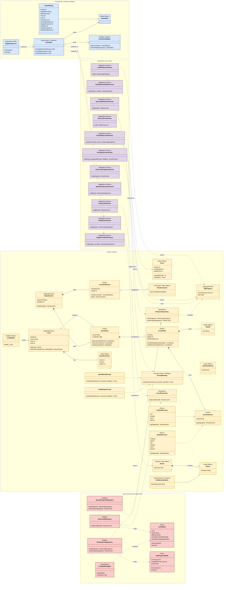

```mermaid
classDiagram
    direction LR

    namespace Presentation_Interface_Adapters {
        class GameBloc:::adapter {
            <<State Pattern / Observer>>
            +onTriggerArrowExit(event, emit)
            +onUndoMove(event, emit)
            +onStartGame(event, emit)
        }
        class GameState:::adapter {
            <<State Pattern>>
        }
        class GamePlaying:::adapter {
            +levelId int
            +levelName String
            +difficulty String
            +rows int
            +cols int
            +moveCount int
            +arrowsRemaining int
            +elapsedSeconds int
            +mistakes int
            +livesRemaining int
            +isEndlessMode bool
        }
        class GameStateMapper:::adapter {
            <<Adapter / Mapper>>
            +toDomain(state) GameSession
            +toPresentation(session) GameState
        }
        class AppBlocObserver:::adapter {
            <<Interceptor / AOP>>
            +onChange()
            +onError()
        }
    }

    namespace Application_Use_Cases {
        class CalculateScoreUseCase:::usecase {
            <<Application Service>>
            +call(moves, elapsedSeconds, mistakes) Result~Score~
        }
        class EvaluateGameStateUseCase:::usecase {
            <<Application Service>>
            +call(session, nowMs) GameEvaluation
        }
        class GetLevelDefinitionUseCase:::usecase {
            <<Application Service>>
            +call(levelId) Result~Level~
        }
        class GetLevelListUseCase:::usecase {
            <<Application Service>>
            +call() Result~List_int~
        }
        class LoadLevelUseCase:::usecase {
            <<Application Service>>
            +call(levelId) Result~Level~
        }
        class LoadProgressUseCase:::usecase {
            <<Application Service>>
            +call() Result~AppProgress~
        }
        class SaveLocalProgressUseCase:::usecase {
            <<Application Service>>
            +call(progress) Result~void~
        }
        class StartGameSessionUseCase:::usecase {
            <<Application Service>>
            +call(level) Result~GameSession~
        }
        class TriggerArrowExitUseCase:::usecase {
            <<Application Service>>
            +call(session, arrowId) Result~GameSession~
        }
        class UndoMoveUseCase:::usecase {
            <<Application Service>>
            +call(session) Result~GameSession~
        }
        class UnlockNextLevelUseCase:::usecase {
            <<Application Service>>
            +call(currentLevel, score) Result~AppProgress~
        }
    }

    namespace Domain_Entities {
        class Level:::domain {
            <<Aggregate Root>>
            +levelId int
            +name String
            +rows int
            +cols int
            +difficulty() String
            +startSession(sessionId, startedAtMs) GameSession
        }
        class AppProgress:::domain {
            <<Aggregate Root>>
            -unlockedLevels List~int~
            -stars Map
        }
        class GameSession:::domain {
            <<Aggregate Root>>
            -sessionId String
            -mistakes int
            +afterMistake() GameSession
        }
        class BoardState:::domain {
            <<Entity>>
            -_arrows Map
            -_nodeIndex Map
            +getArrowAtNode(node) ArrowEntity
            +withoutArrow(arrow) BoardState
            +replacing(updated) BoardState
        }
        class ArrowEntity:::domain {
            <<Entity>>
            +id String
            +length int
            +isSwitchable bool
            +withShiftedNodes(newNodes) ArrowEntity
            +withDirection(newDirection) ArrowEntity
        }
        class CommandHistory:::domain {
            <<Entity>>
            +canUndo bool
            +length int
            +push(command) CommandHistory
            +pop() MoveCommand
        }
        class Score:::domain {
            <<Value Object>>
            +moves int
            +timeElapsed int
            +totalPoints int
            +calculateFinal() int
            +copyWith() Score
        }
        class MoveCommand:::domain {
            <<Command / Value Object>>
            +previousState BoardState
        }
        class BoardGeometry:::domain {
            <<Value Object>>
            +rows int
            +cols int
            +depth int
        }
        class NodeId:::domain {
            <<Value Object>>
            +key String
        }
        class ExitCheckResult:::domain {
            <<Value Object>>
            +canExit bool
        }
        class DirectionEnum:::domain {
            <<Enum>>
            +value String
            +getOpposite() DirectionEnum
        }
        class CardinalDirection:::domain {
            <<Enum>>
            +UP
            +DOWN
            +LEFT
            +RIGHT
            +getOpposite() DirectionEnum
        }
        class SpatialDirection:::domain {
            <<Enum>>
            +FRONT
            +BACK
            +UP
            +DOWN
            +LEFT
            +RIGHT
            +getOpposite() DirectionEnum
        }
        class Result:::domain {
            <<Monad / Value Object>>
            +isSuccess bool
        }
        class Failure:::domain {
            <<Value Object>>
            -message String
        }
        class PathBlockedFailure:::domain {
            <<Domain Event / Exception>>
            -blockingArrowId String
        }
        class ScoringStrategy:::domain {
            <<Domain Service / Strategy>>
            +calculateScore(moves, seconds, mistakes) Score
        }
        class MoveBasedScoring:::domain {
            +calculateScore(moves, seconds, mistakes) Score
        }
        class CubeMangoScoring:::domain {
            +calculateScore(moves, seconds, mistakes) Score
        }
        class LevelBuilder:::domain {
            <<Builder Pattern>>
            +build() Level
        }
        class ILevelRepository:::domain {
            <<Repository>>
            +loadLevel(levelId) Result~Level~
        }
        class IProgressRepository:::domain {
            <<Repository>>
            +loadProgress() Result~AppProgress~
            +saveProgress(progress) Result~void~
        }
    }

    namespace Data_Frameworks_Infrastructure {
        class HiveLevelRepository:::infra {
            <<Adapter>>
            +loadLevel(levelId) Result~Level~
        }
        class HiveProgressRepository:::infra {
            <<Adapter>>
            +loadProgress() Result~AppProgress~
            +saveProgress(progress) Result~void~
        }
        class SyncedProgressRepository:::infra {
            <<Adapter>>
            +loadProgress() Result~AppProgress~
            +saveProgress(progress) Result~void~
        }
        class LevelModel:::infra {
            <<DTO>>
            -id int
            -name String
            -difficulty String
            -boardSize BoardSizeModel
            -boardState BoardStateModel
            +fromJson(json)
            +toJson()
        }
        class AppProgressModel:::infra {
            <<DTO>>
            -currentLevel int
            -completedLevels List~int~
            -scores Map
            +fromJson(json)
            +toJson()
        }
        class LevelModelAdapter:::infra {
            <<TypeAdapter>>
            +read(reader)
            +write(writer, obj)
        }
    }

    %% Presentation Relationships
    GamePlaying --|> GameState
    GameBloc "1" --> "1" GameState : emits
    GameBloc "1" --> "1" GameStateMapper : uses
    AppBlocObserver "1" --> "0..*" GameBloc : observes
    GameBloc ..> TriggerArrowExitUseCase : depends on
    GameBloc ..> UndoMoveUseCase : depends on

    %% Application Relationships
    CalculateScoreUseCase ..> Score : returns
    TriggerArrowExitUseCase ..> Result : returns
    LoadLevelUseCase ..> ILevelRepository : depends on
    LoadProgressUseCase ..> IProgressRepository : depends on
    CalculateScoreUseCase ..> ScoringStrategy : depends on
    LoadProgressUseCase ..> AppProgress : returns
    UnlockNextLevelUseCase ..> AppProgress : returns
    SaveLocalProgressUseCase ..> AppProgress : uses

    %% Domain Relationships
    Level "1" o-- "1" BoardState : contains
    Level "1" *-- "1" BoardGeometry : has
    GameSession "1" *-- "1" BoardState : owns
    BoardState "1" *-- "0..*" ArrowEntity : composed of
    ArrowEntity "1" *-- "1" NodeId : uses
    ArrowEntity "1" *-- "1" DirectionEnum : uses
    CardinalDirection ..|> DirectionEnum
    SpatialDirection ..|> DirectionEnum
    GameSession "1" *-- "1" CommandHistory : owns
    CommandHistory "1" o-- "0..*" MoveCommand : aggregates
    LevelBuilder ..> Level : builds
    Result "1" *-- "0..1" Failure : contains
    PathBlockedFailure --|> Failure
    MoveBasedScoring ..|> ScoringStrategy
    CubeMangoScoring ..|> ScoringStrategy
    IProgressRepository ..> AppProgress : manages

    %% Data Relationships
    HiveLevelRepository ..|> ILevelRepository
    HiveProgressRepository ..|> IProgressRepository
    SyncedProgressRepository ..|> IProgressRepository
    HiveLevelRepository ..> LevelModel : maps
    HiveProgressRepository ..> AppProgressModel : maps
    LevelModelAdapter ..> LevelModel : serializes

    %% Estilos de Capas (Colores)
    classDef domain fill:#FFF2CC,stroke:#D6B656,stroke-width:2px,color:#000
    classDef usecase fill:#E1D5E7,stroke:#9673A6,stroke-width:2px,color:#000
    classDef adapter fill:#DAE8FC,stroke:#6C8EBF,stroke-width:2px,color:#000
    classDef infra fill:#F8CECC,stroke:#B85450,stroke-width:2px,color:#000
```
